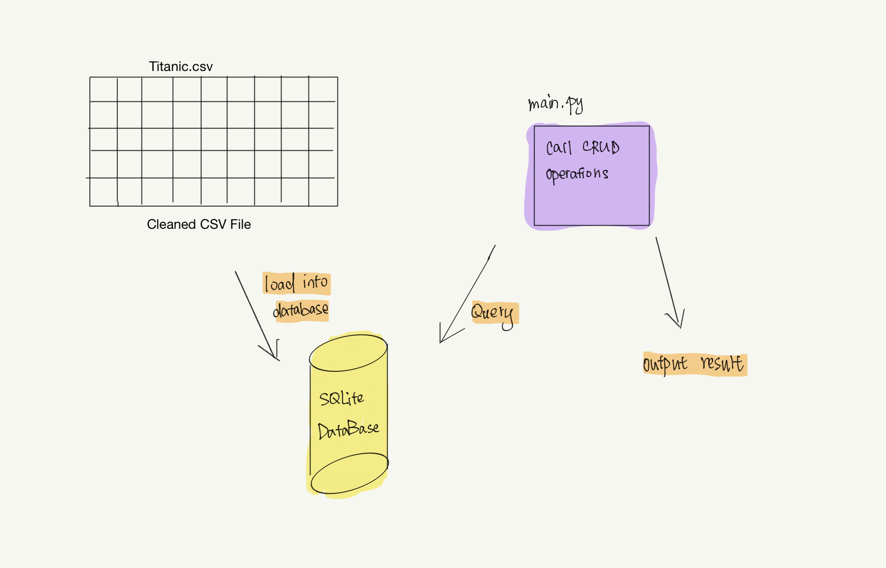

# Week 6 Mini Project 

Gavin Li `gl183`

## Purpose of the project

The purpose of this week's mini project is to connect to database using python scripts, and manipulate database using python scripts.

## Result for `make test` and `make lint`

## CRUD result and `make query`

## A flow chart demonstrating the workflow

