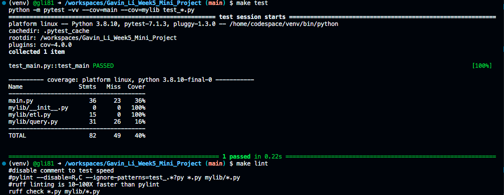
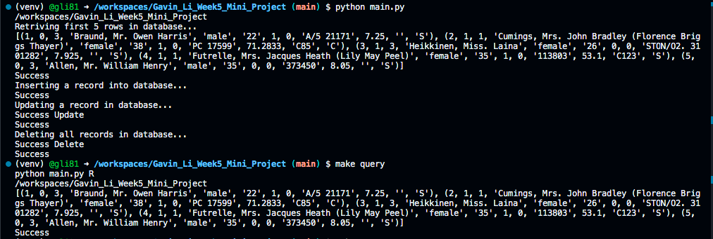

# Week 6 Mini Project [](https://github.com/nogibjj/Gavin_Li_Week6_Mini_Project/actions/workflows/cicd.yml)

Gavin Li `gl183`

## Purpose of the project

The purpose of this week's mini project is to connect to a cloud database using python scripts, and design a complex SQL query that involves __join__, __aggregation__, and __sorting__. Then I will explain what the query is doing.

## Result for `make test` and `make lint`



## CRUD result and `make query`


## A flow chart demonstrating the workflow


## My complex SQL query

```sql
SELECT
    state_abbrevs.state,
    SUM(total) AS total_crimes
FROM us_crime
JOIN state_abbrevs
ON us_crime.state = state_abbrevs.abbrev
GROUP BY state_abbrevs.state
ORDER BY total_crimes DESC;
```

In this query, I first joined the two tables together using the state abbreviation (called `state` in `us_crime` and called `abbrev` in `state_abbrevs`) to match state abbreviations to state full name from `state_abbrevs` table.

Then, I sorted the table by the state full name, and calculated summation of total crime case numbers for each state.

At last, I ranked the entire table by the number of crime cases across three years of 2016-2018 in descending order. It turns out that California has the most crime cases in those three years.

The expecetd output should be a table of two columns. The first column is state full name, the second column is total number of crime cases in that state during 2016-2018.